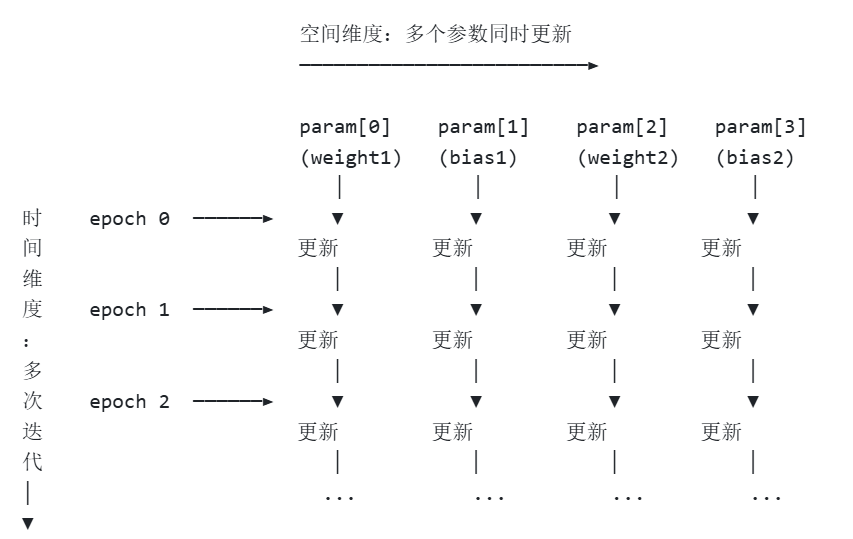
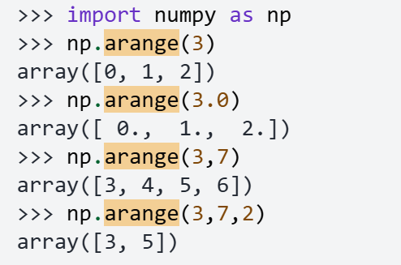

从12.15继续：
---
12.15
* ops文件ndarray, Tensor 的转换，造成困难
* detach(), 避免计算图过大，造成内存泄漏
* hw1 all pass , not totally understood
* __call__, __init__, init__, hhhhhh
* 实现nn.Linear, 对__add__ 重载 和 broadcast 手动实现有了更深的理解
---
12.16
* keepdims, self.axis, .reshape(shape).broadcast_to(XX.shape)  
    give you an exp :

* 注意传参： axis是从0开始数的 ， 注意区分和shape的区别

12.17
* 完善nn_basic.py，kaimingNorm, kaimingUniform
* Linear module finished
* batchnorm, layernorm , dropout class finished
* hw1构建的基础功能，调用他们作为原子操作，op s--> module,往下递归微分
* 在写SGD.step() 时， 对params的理解：

* grad 也是Tensor, 这是出于计算方便的工程考量，并不作为node加入计算图，实际上， 为了节约内存，常用懒汉式在BP期才加载
* 实现momentum 和 Adam, Adam's bias correction用来避免momentum策略导致的训练初期步长太小
* horizontal flip and random crop, 提高泛化能力
* dataset 读了转成ndarray, dataloader 负责
---
12.19

* 在实现ResidualBlock的过程中， nn.Sequential串联起module, Module 的封装与数据是分离的

* 还有魔法方法__getitem__， 丢人呐，加上括号才是实例化
* datas = self.dataset[batch_indices], dataset 传回来的是tuple，所以这里batch_indices数组传入后， 得到的datas是数组tuple
* Tensor(data) for data in datas 也是对于tuple中的一个元素操作
