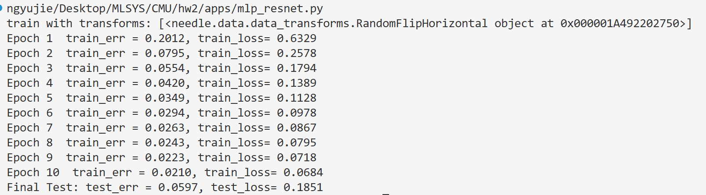

以下是在实践过程中部分有功能代表性的代码,均为独立**手写**：

numpy backend in gpu
见`hw3/src/ndarray_backend.cu`
```cpp
/*   实现后端调用
*   - EwiseMul, ScalarMul
 *   - EwiseDiv, ScalarDiv
 *   - ScalarPower
 *   - EwiseMaximum, ScalarMaximum
 *   - EwiseEq, ScalarEq
 *   - EwiseGe, ScalarGe
 *   - EwiseLog
 *   - EwiseExp
 *   - EwiseTanh*/
//begin
 __device__ scalar_t Mul(scalar_t x, scalar_t y) {return x * y;}
 __device__ scalar_t Div(scalar_t x, scalar_t y) {return x / y;}
 __device__ scalar_t Power(scalar_t x, scalar_t y) {return std::pow(x, y);}
 __device__ scalar_t Maximum(scalar_t x, scalar_t y) {return (x > y) ? x : y;}
 __device__ scalar_t Eq (scalar_t x, scalar_t y) {return (x == y);}
 __device__ scalar_t Ge (scalar_t x, scalar_t y) {return (x >= y);}
 
 #define EWISE_KERNEL(kernel_name, opr)                                \
  __global__ void kernel_name(scalar_t *a, scalar_t *b, scalar_t *out, \
    size_t size) {                                                      \
      size_t idx = threadIdx.x + blockDim.x * blockIdx.x;               \
      if (idx < size) {                                                 \
        out[idx] = opr(a[idx], b[idx]);                                 \
      }                                                                 \
  }                                                                     \

#define EWISE_HOST(host_name, kernel_name)                                    \
 void host_name(const CudaArray& a, const CudaArray& b, CudaArray* out) {     \
  CudaDims dim = CudaOneDim(out->size);                                        \
  kernel_name<<<dim.grid, dim.block>>>(a.ptr, b.ptr, out->ptr, out->size);   \
 }                                                                            \

EWISE_KERNEL(EwiseMulKernel, Mul);
EWISE_HOST(EwiseMul, EwiseMulKernel);

EWISE_KERNEL(EwiseDivKernel, Div);
EWISE_HOST(EwiseDiv, EwiseDivKernel);

EWISE_KERNEL(EMaxKernel, Maximum);
EWISE_HOST(EwiseMaximum, EMaxKernel);

EWISE_KERNEL(EwiseEqKernel, Eq);
EWISE_HOST(EwiseEq, EwiseEqKernel);

EWISE_KERNEL(EwiseGeKernel, Ge);
EWISE_HOST(EwiseGe, EwiseGeKernel);

//实现 SCALAR 部分
#define SCALAR_KERNEL(kernel_name, ops)                             \
__global__  void kernel_name(scalar_t *a, scalar_t value,           \
  scalar_t *out, size_t size) {                                    \
  size_t idx = threadIdx.x + blockDim.x * blockIdx.x;               \
  if (idx < size)                                                   \
    out[idx] = ops(a[idx], value);                                    \
}                                                                    \

#define SCALAR_FUNC(func_name, kernel_name)                       \
void func_name(const CudaArray& a, scalar_t value, CudaArray* out) {  \
  CudaDims dim = CudaOneDim(out->size);                                \
  kernel_name<<<dim.grid, dim.block>>>(a.ptr, value, out->ptr, out->size);\
}\

SCALAR_KERNEL(SMulK, Mul);
SCALAR_FUNC(ScalarMul, SMulK);

SCALAR_KERNEL(SDivK, Div);
SCALAR_FUNC(ScalarDiv, SDivK);

SCALAR_KERNEL(ScalarPowerKernel, Power);
SCALAR_FUNC(ScalarPower, ScalarPowerKernel);

SCALAR_KERNEL(SMaxK, Maximum);
SCALAR_FUNC(ScalarMaximum, SMaxK);

SCALAR_KERNEL(SEqK, Eq);
SCALAR_FUNC(ScalarEq, SEqK);

SCALAR_KERNEL(SGeK, Ge);
SCALAR_FUNC(ScalarGe, SGeK);

// 实现single object 部分
// log， exp， tanh
#define SINGLE_KERNEL(kernel_name, ops)                                 \
__global__ void kernel_name(scalar_t *a, scalar_t *out, size_t size) {  \
  size_t idx = threadIdx.x + blockIdx.x * blockDim.x;                   \
  if (idx < size) {                                                     \
    out[idx] = ops(a[idx]);                                             \
  }                                                                     \
}                                                                       \


#define SINGLE_HOST(func_name, kernel_name)                              \
void func_name(const CudaArray& a, CudaArray* out) {                     \
  CudaDims dim = CudaOneDim(out->size);                                    \
  kernel_name<<<dim.grid, dim.block>>>(a.ptr, out->ptr, out->size);         \
}                                                                          \

SINGLE_KERNEL(ELogK, std::log);
SINGLE_HOST(EwiseLog, ELogK);

SINGLE_KERNEL(EExpK, std::exp);
SINGLE_HOST(EwiseExp, EExpK);

SINGLE_KERNEL(ETanhK, std::tanh);
SINGLE_HOST(EwiseTanh, ETanhK);

```
反向传播中的拓扑排序 `autograd.py` 
```py
def compute_gradient_of_variables(self_tensor, out_grad):
    node_out_grads = {}
    node_out_grads[self_tensor] = [out_grad]
    nodes_topo = find_topo_sort([self_tensor])
    
    for node in nodes_topo:
        node.grad = sum_node_list(node_out_grads[node])

        if node.op is None:
            continue

        formers_grads = node.op.gradient_as_tuple(node.grad, node)

        for former_node, former_grad in zip(node.inputs, formers_grads):
            if former_node not in node_out_grads:
                node_out_grads[former_node] = []
            node_out_grads[former_node].append(former_grad)

def find_topo_sort(node_list: List[Value]) -> List[Value]:
    visited = set()
    topo_order = []
    for node in node_list:
        topo_sort_dfs(node, visited, topo_order)
    return list(reversed(topo_order))


def topo_sort_dfs(node, visited, topo_order):
    """Post-order DFS"""
    if node in visited :
        return
    visited.add(node)
    for input in node.inputs:
        topo_sort_dfs(input, visited, topo_order)
    topo_order.append(node)
```
TensorOp类`ops_mathematic.py`
```py
class Summation(TensorOp):
    def __init__(self, axes: Optional[tuple] = None):
        self.axes = axes

    def compute(self, a):
        ### BEGIN YOUR SOLUTION
        return array_api.sum(a, axis = self.axes)
        ### END YOUR SOLUTION

    def gradient(self, out_grad, node):
        ### BEGIN YOUR SOLUTIOU
        input_shape = node.inputs[0].shape
        # 可以不只沿着一个维度做summation
        if self.axes is None:
            axes = tuple(range(len(input_shape)))
        elif isinstance(self.axes, int):
            axes = (self.axes,)
        else:
            axes = self.axes

        target_shape = list(out_grad.shape)
        for axis in sorted(axes):
            target_shape.insert(axis, 1)

        out_grad = out_grad.reshape(target_shape)
        # 相当于 out_grad * all_ones
        return broadcast_to(out_grad, input_shape)
```
```py
class LogSumExp(TensorOp):
    def __init__(self, axes: Optional[tuple] = None) -> None:
        self.axes = axes

    def compute(self, Z: NDArray) -> NDArray:
        ### BEGIN YOUR SOLUTION
        Z_max = array_api.max(Z, axis = self.axes, keepdims = True)
        Z_stable = Z - Z_max
        Z_exp = array_api.exp(Z_stable)
        Z_exp_sum = array_api.sum(Z_exp, axis = self.axes, keepdims = True)
        logsumexp = array_api.log(Z_exp_sum) + Z_max
        Z_max_final = array_api.max(Z, axis = self.axes, keepdims= False)
        return logsumexp.reshape(Z_max_final.shape)

        ### END YOUR SOLUTION

    def gradient(self, out_grad: Tensor, node: Tensor):
        ### BEGIN YOUR SOLUTION
        Z = node.inputs[0]

        shape = list(Z.shape)
        axes = self.axes if self.axes is not None else tuple(range(len(shape)))

        for ax in axes:
            shape[ax] = 1

        node_new = node.reshape(shape).broadcast_to(Z.shape)
        grad = ops.exp(Z - node_new)
        out_grad_ = out_grad.reshape(shape).broadcast_to(Z.shape)
        return out_grad_ * grad
        ### END YOUR SOLUTION
```
Module类 `nn_basic.py`
```py
class SoftmaxLoss(Module):
    def forward(self, logits: Tensor, y: Tensor) -> Tensor:
        ### BEGIN YOUR SOLUTION
        log_softmax = ops.logsoftmax(logits)
        batch_size = logits.shape[0]
        y_hot = init.one_hot(logits.shape[1], y)
        Z_hot = log_softmax * y_hot
        loss = -ops.summation(ops.summation(Z_hot, axes = (1,))) / batch_size
        return loss
        ### END YOUR SOLUTION
```
Optimizer类 `optim.py`
```py
class SGD(Optimizer):
    def __init__(self, params, lr=0.01, momentum=0.0, weight_decay=0.0):
        super().__init__(params)
        self.lr = lr
        self.momentum = momentum
        self.u = {} #储存动量
        self.weight_decay = weight_decay

    def step(self):
        ### BEGIN YOUR SOLUTION
        for single_param in self.params:
            grad = single_param.grad.data + self.weight_decay * single_param.data
            if single_param not in self.u:
                self.u[single_param] = 0
            self.u[single_param] = self.momentum * self.u[single_param] + (1 - self.momentum) * grad
            single_param.data = single_param.data - self.lr * self.u[single_param]
        ### END YOUR SOLUTION
```
Adam Optimizer's step part:
```py
def step(self):
    ### BEGIN YOUR SOLUTION
    self.t += 1
    for param in self.params:
        #l2 norm:
        grad = param.grad.data + self.weight_decay * param.data
        if param not in self.m:
            self.m[param] = 0
        if param not in self.v:
            self.v[param] = 0
        self.m[param] = self.beta1 * self.m[param] + (1 - self.beta1) * grad
        self.v[param] = self.beta2 * self.v[param] + (1 - self.beta2) * (grad ** 2)
        m_hat = self.m[param] / (1 - self.beta1 ** self.t)
        v_hat = self.v[param] / (1 - self.beta2 ** self.t)
        tem_grad = m_hat / (v_hat ** 0.5 + self.eps)
        param.data = param.data - np.float32(self.lr) * ndl.Tensor(tem_grad, dtype = param.data.dtype)
    ### END YOUR SOLUTION
```
DataSet 类
```py
class MNISTDataset(Dataset):
    def __init__(
        self,
        image_filename: str,
        label_filename: str,
        transforms: Optional[List] = None,
    ):
        ### BEGIN YOUR SOLUTION
        with gzip.open(image_filename, 'rb') as f:
            magic, num, rows, cols = struct.unpack('>4I', f.read(16))
            images = np.frombuffer(f.read(), dtype = np.uint8)
            images = images.reshape((num, rows, cols, 1))
            images = images.astype(np.float32) / 255.0

        with gzip.open(label_filename, 'rb') as f:
            magic, num = struct.unpack('>2I', f.read(8))
            labels = np.frombuffer(f.read(), dtype = np.uint8)
            labels = labels.reshape((num, ))
        
        self.images = images
        self.labels = labels
        self.transforms = transforms

        ### END YOUR SOLUTION

    def __getitem__(self, index) -> object:
        ### BEGIN YOUR SOLUTION
        img = self.images[index]
        label = self.labels[index]
        if isinstance(index, (list, np.ndarray, tuple)):
            img = np.stack([self.apply_transforms(single) for single in img], axis = 0)
        else:
            img = self.apply_transforms(img)

        return img, label
        ### END YOUR SOLUTION

    def __len__(self) -> int:
        ### BEGIN YOUR SOLUTION
        return self.images.shape[0]
        ### END YOUR SOLUTION
```
build of ResidualBlock and MLPResNet
训练脚本见`hw2/apps/mlp_resnet.py`
```py
def ResidualBlock(dim, hidden_dim, norm=nn.BatchNorm1d, drop_prob=0.1):
    ### BEGIN YOUR SOLUTION
    sequence_1 =  nn.Sequential(
                      nn.Linear(dim, hidden_dim),
                      norm(hidden_dim),
                      nn.ReLU(),
                      nn.Dropout(drop_prob),
                      nn.Linear(hidden_dim, dim),
                      norm(dim)
                  )
    sequence_2 = nn.Sequential(
                      nn.Residual(sequence_1),
                      nn.ReLU()
    )
    return sequence_2
    ### END YOUR SOLUTION

def MLPResNet(
    dim,
    hidden_dim=100,
    num_blocks=3,
    num_classes=10,
    norm=nn.BatchNorm1d,
    drop_prob=0.1,
):
    ### BEGIN YOUR SOLUTION
    sequence = nn.Sequential(
                nn.Linear(dim, hidden_dim),
                nn.ReLU(),
                *[ResidualBlock(hidden_dim, hidden_dim//2, norm, drop_prob) for _ in range(num_blocks)],
                nn.Linear(hidden_dim, num_classes)
    )
    return sequence
    ### END YOUR SOLUTION
```

construct and debug log：
---
1.13
* 移植的时候出现问题：

  为了计算图的延续， 必须在BACKEND添加max， 支持反向传播
* add TensorOp Stack, Max, Tanh, 其中Stack最不好写， Stack.gradient还没有想明白
关键代码：
```py
 new_shape = list(args[0].shape).insert(self.axis, len(args))
 empty_in_new_shape = array_api.empty(new_shape, dtype=args[0].dtype, device = args[0].device)
 for i, arg in enumerate(args):
     slices = [slice(None)] * len(new_shape)  #slices is a data form of "[x, y, z, ...]"
                                              # slice(None) means [:]
     slices[self.axis] = i
     empty_in_new_shape[tuple(slices)] = arg 
 return empty_in_new_shape
```
1.12
* watch lecture17, update notes
---
1.6
* 开始将hw1,2,3 移植到hw4
* 代码重构的过程中， 我发现ops_logarithmic.py 部分logsumexp, 指定axes的功能实现的不是很清楚。 暂时先实现二维版本
* fun fact: max(target, axis = 2, keepdims = true), max.shape = (2, 3, 4, 5, 6), 对这种多维max是怎么生效的呢？
   * result.shape = (2, 3, 1, 5, 6), 单独看axis = 2 的位置， 有5 * 6 = 30个子元素，对于30个位置， 同时有4个平行的兄弟元素进行比较 
---
1.4 白天
* add ReduceMax, ReduceSum in cuda, hw3 finished

* 又是函数宏， 理解更深了吧, KERNEL 和 HOST 一开始声明顺序反了
* opr 需要预先创建， host_name, kernel_name, 通过函数宏直接填进去
* const CudaArray& a 里的 & 是“引用”，不是取地址, 语义上相当于 C 的 “传只读指针” (const CudaArray* a)，但用法更像别名，函数体直接写 a.foo 而不是 a->foo
* EwiseOps等函数中，CudaArray* out 输出参数习惯用指针， 主要是工程上易读性的考虑：
  * 本函数对目标的所有权： “不管new / delete， 只负责写入”
  * 提示写入
  * 可以合法位nullptr， 更容易在内部检查或者抛错
* 增添了如下调用的GPU端实现

    

* 这是自从hw2 model， data， optimizer 分块实现以来码的最爽的一次

---
commit records不是很干净， 因为需要不断的上传，方便colab克隆 

1.3
* 容易混的地方： CudaArray虽然由cpu创建， 调用构造函数过后显存分配在GPU端
* cuda: EwiseSetItem, 注意grid的设置通过BASE_THREAD_NUM, 尽量发挥硬件的并行性能，　“一个线程处理一个元素”
* 启动 kernel的时候， 实参会被拷贝到GPU上的参数空间， 所以CudaVec已经拷贝过去了
* *a, *out, 就必须手动分配到GPU
---
1.2
* cuda: add naive MatMul
---
1.1
* cpu: add reduce, naive_Matmul
* debug : MatMUL_Tile, passed in a 4-dimension array, the memory is continuous only in each Tile, and i wrongly treat it as 2-d type of continuous
---
12.31. 2025 最后一天
* cpu backend support: 
  * compact() 无序存储的array 赋给紧凑存储
  * EwiseSetitem() 紧凑存储的array赋给无序, 当前实现n_dim = 0时有下溢风险
* 函数式宏， 写了一批ElementWise ops, Scalar ops, 真带劲
---
12.30
* implement getitem(), 根据切片， 返回NDArray视图, 起到虚拟分割的作用
``` python
new_strides = NDArray.compact_strides_yyj(new_shape)
new_strides = tuple(self.strides[iter] for iter in new_axes) #真闹心啊， 这两句
```
---
12.29
* imple broadcast_to with no memory cost, 从shape[i]=1扩展到n， 内存访问步长为0, :)zip is fun, it returns iterator

12.28
* hw3: ops backend implement，结构操作尽量python处理 ，算数交给底层cpp
* as_strided： 在handle句柄相同时，设置新的shape和strides， 通过修改元数据生成新的视图， 内存开销为0， 否则alloc memory
* strides在内存紧凑期间仅由shape就能确定， 句柄handle可能指向三个地方：numpy的内存， cpu'ram, gpu's 显存
* permute 仅需要np.random.shuffle(tem = range(len(stuff.shape))), 就能确定新的stuff.shape, 进而确定新的strides

12.26
* 跑起来了， 但是和checkpoint不一致
* 找到问题了，module创建顺序不同 → RNG 消费顺序不同 → 权重不同 → forward 输出不同
* 单独跑MLPResNet， 使用不同的数据预先方式：
    * 不处理： 

      

      hidden-norm 从100到150， 表现力更强， 前期收敛更快， 然而结果差别不大

      

    * RandomFlipHorizontal:
      水平翻转强迫模型学习更一般的特征

      

      真打脸， 还不如不处理，可能是epoch太少了
    * RandomCrop:

      
      
      也差一些， 这个还能理解一些， 裁剪了一些特征

---

##### 一些零散的先放在这里：


12.15
* ops文件ndarray, Tensor 的转换，造成困难
* detach(), 避免计算图过大，造成内存泄漏
* hw1 all pass , not totally understood
* __call__, __init__, init__, hhhhhh
* 实现nn.Linear, 对__add__ 重载 和 broadcast 手动实现有了更深的理解
* 无独有偶： 为什么`Transpose`,` Reshape` 做逆运算就是微分了？ 为什么`Broadcast_to`的微分恰好是`Summation`? 不是想当然的！ 因为我们考察的是每个元素在forward过程中的贡献！！ 这样就能理解为什么抽象的非数值操作也有微分的概念。

---
12.16
* keepdims, self.axis, .reshape(shape).broadcast_to(XX.shape)  
    give you an exp :


12.17
* 完善nn_basic.py，kaimingNorm, kaimingUniform
* Linear module finished
* batchnorm, layernorm , dropout class finished
* hw1构建的基础功能，调用他们作为原子操作，op s--> module,往下递归微分
* 在写SGD.step() 时， 对params的理解：


* grad 也是Tensor, 这是出于计算方便的工程考量，并不作为node加入计算图，实际上， 为了节约内存，常用懒汉式在BP期才加载
* 实现momentum 和 Adam, Adam's bias correction用来避免momentum策略导致的训练初期步长太小
* horizontal flip and random crop, 提高泛化能力
* dataset 读了转成ndarray, dataloader 负责iter and next
---
12.19

* 在实现ResidualBlock的过程中， nn.Sequential串联起module, Module 的封装与数据是分离的


* 一些魔法方法和自动调用的对应：


* 常用内置函数


* datas = self.dataset[batch_indices], dataset 传回来的是tuple，所以这里batch_indices数组传入后， 得到的datas是数组tuple
* Tensor(data) for data in datas 也是对于tuple中的一个元素操作


